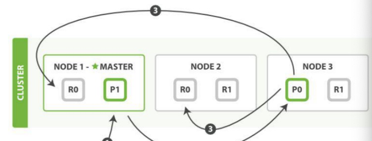

# Elasticsearch写流程

写入单个文档: Index请求
写入多个文档: Bulk请求

写入单个文档操作流程:

1.客户端向node1发送写请求

2.根据文档id确定所属分片0,在通过内容路由表信息找到主分片在node3，请求转发到node3

3.node3上执行写操作。主分片写入成功，通知副分片，所有副分片写入成功，向协调节点报告成功，协调节点在报告给客户端写入成功。

写一致性策略默认是quorum
quorum  = int((primary+number_of_replicas)/2) +1
