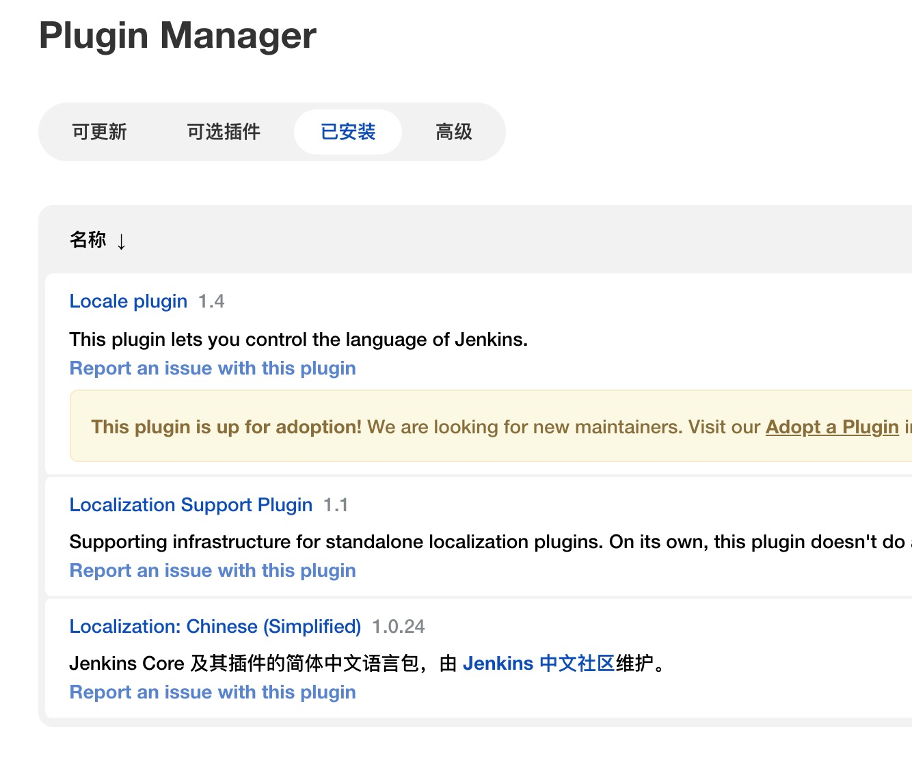
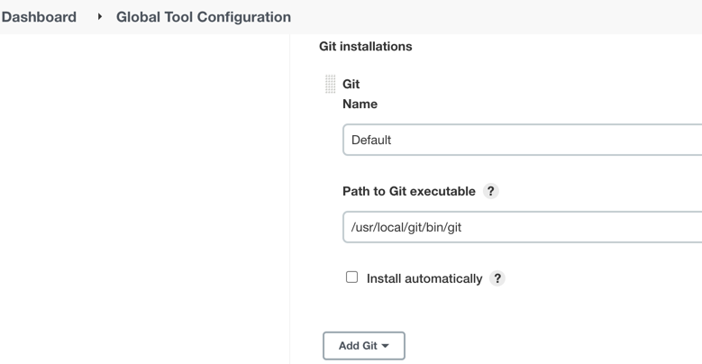
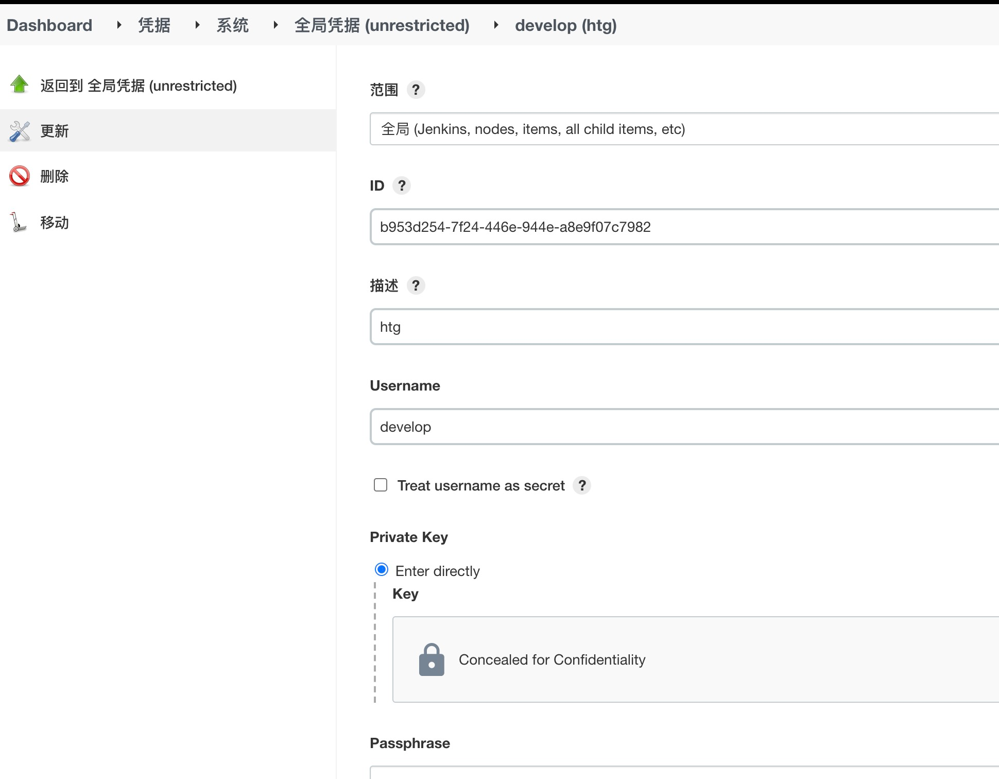
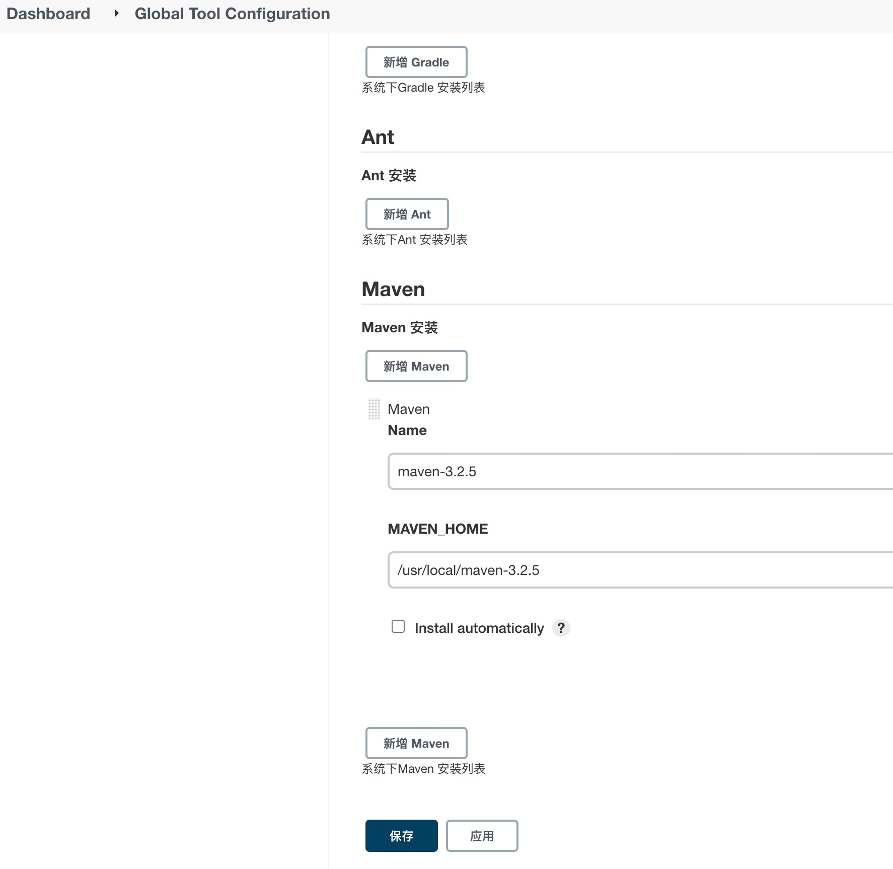
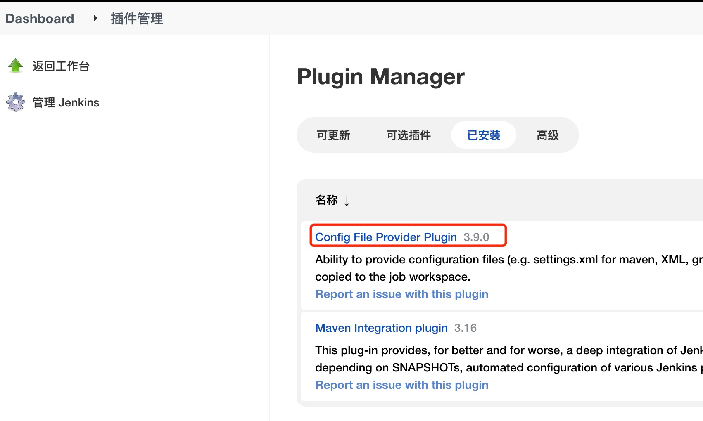
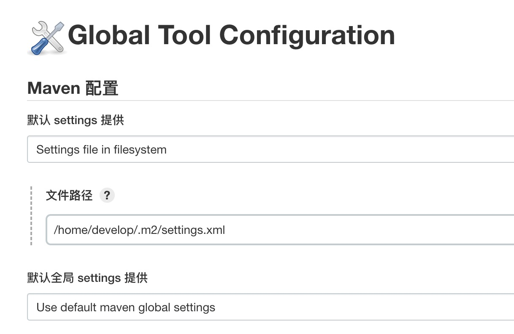

# Jenkins安装教程

机器ip: 121.89.243.115 用户: develop

### 1.安装Jenkins

````

wget -O /etc/yum.repos.d/jenkins.repo http://pkg.jenkins-ci.org/redhat/jenkins.repo
rpm --import https://jenkins-ci.org/redhat/jenkins-ci.org.key

yum install -y jenkins --nogpgcheck   注: --nogpgcheck 跳过公钥检查

````

### 2.修改端口号，修改jenkins用户权限

vi /etc/sysconfig/jenkins
找到8080修改为对应端口号即可

修改jenkins用户权限:
```
sudo vim /etc/sysconfig/jenkins
JENKINS_USER="root"
sudo chown -R root:root /usr/lib/jenkins
```
启动:
```
service jenkins start/stop/restart
```

### 3.登录页面

初始密码:
```
sudo cat /var/lib/jenkins/secrets/initialAdminPassword
```
aa0910dc2d9a405fac2f6155b3e64197

### 4.汉化



中文插件

### 5.安装各种插件

安装插件 ( 安装过程可能会失败,多试几次就好了 )

Git Parameter ( 用于参数化构建中动态获取项目分支 )

Generic Webhook Trigger ( 用于解析 Webhook 传过来的参数 )

GitLab ( 用于推送构建结果给 GitLab )

### 6.jenkins 配置Git

卸载机器原有git，重新安装git


### 7. jenkins创建项目并配置git
git仓库无论是gitlab还是本地git，都通用

- gitlab:

htg-crm-project项目添加121.89.243.115(jenkins所在机器)机器的公钥，并在机器上git clone能否免密检出项目
- git本地仓库:

git init 创建本地仓库
/opt/.ssh/ 目录下，把公钥加入 authorized_keys, 并在机器上git clone看能否免密检出项目

### 8.Jenkins配置全局凭据:



选择 SSH Username with private key 方式配置

username: develop

Private Key: /opt/.ssh/id_rsa

gitlab<-->jenkins<--> 服务器之间就能打通了


### 9.maven配置及config插件

- 9.1 jenkins添加maven配置



- 9.2 下载config插件，配置maven setting.xml文件





- htg-crm-dev发布脚本:
```

cp /var/lib/jenkins/workspace/htg-crm-server-dev/htg-crm-server/target/htg-crm-server-1.0-SNAPSHOT.jar /opt/project/htg-crm-project/
/opt/project/htg-crm-project/startup.sh restart

```

- htg-web-dev发布脚本:
```
node -v
npm -v
webPath=/opt/project/htg-crm-web/
npm install
npm run build
zip -q -r dist.zip dist/m
sudo cp dist.zip $webPath
if [[ ! -d "$webPath/dist" ]]; then
 echo "文件夹不存在"
else
 echo "文件夹存在"
 # 备份dist
 sudo rm -rf $webPath/dist
fi
sudo cp -r dist/ $webPath
```
